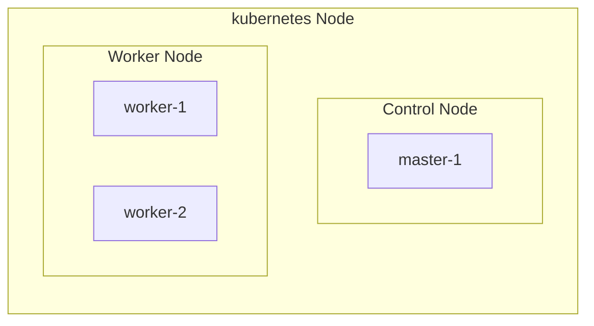
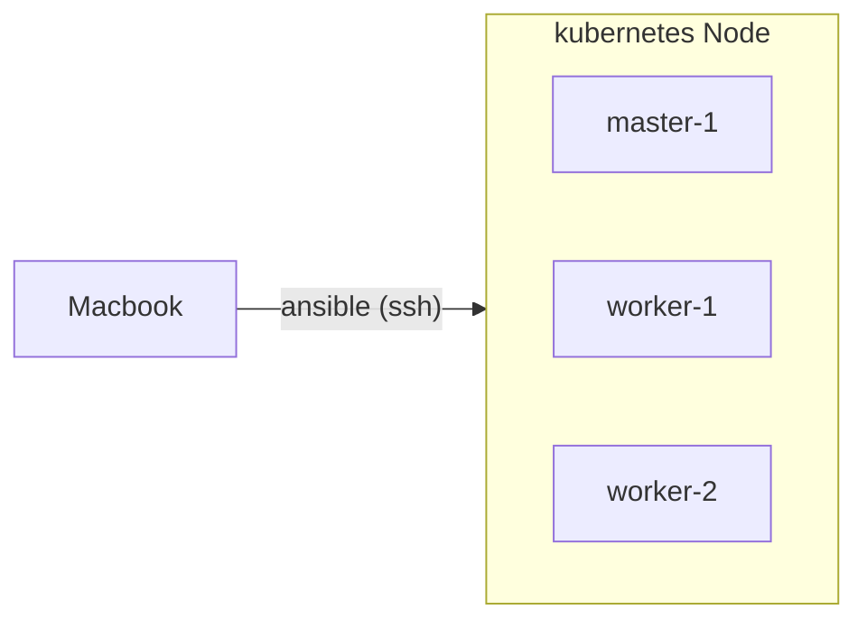

# k8s<!-- omit in toc -->

- ローカルサーバのk8sのセットアップや試行錯誤用リポジトリ

## Categories<!-- omit in toc -->

- [Infra](#infra)
  - [Structure](#structure)
  - [Management](#management)
  - [IP](#ip)
- [Setup](#setup)
  - [1. hostname](#1-hostname)
  - [2. IP固定](#2-ip固定)
  - [3. SSHポート変更](#3-sshポート変更)
  - [4. 公開鍵を登録](#4-公開鍵を登録)
  - [6. Ansible](#6-ansible)
  - [7. Kubernetes](#7-kubernetes)
  - [8. Helm](#8-helm)
  - [9. Arkade](#9-arkade)
  - [10. MetalLB](#10-metallb)
  - [11. Longhorn](#11-longhorn)
  - [12. Docker Registry (TLS)](#12-docker-registry-tls)
  - [13. OpenFaaS](#13-openfaas)
  - [14. Portainer](#14-portainer)
  - [15. Argo CD](#15-argo-cd)
  - [16. firewall](#16-firewall)
- [Command](#command)
  - [Kubernetes](#kubernetes)
  - [Ansible](#ansible)
  - [ufw](#ufw)

## Infra

### Structure



### Management



### IP

| port | application |
| -- | -- |
| 192.168.0.201 | Longhorn |
| 192.168.0.202 | docker-registry |
| 192.168.0.203 | OpenFaaS |
| 192.168.0.207 | Portainer |
| 192.168.0.208 | Argo CD |
| 192.168.0.210 ... 217 | price-monitoring |

## Setup

### 1. hostname

- 各サーバのホスト名を変更する

  - master-1

    ```bash
    sudo su
    hostnamectl set-hostname master-1
    reboot
    #=> reboot...

    hostname
    #=> master-1
    ```

  - worker-1

    ```bash
    sudo su
    hostnamectl set-hostname worker-1
    reboot
    #=> reboot...

    hostname
    #=> worker-1
    ```

  - worker-2

    ```bash
    sudo su
    hostnamectl set-hostname worker-2
    reboot
    #=> reboot...

    hostname
    #=> worker-2
    ```

### 2. IP固定

- 各サーバのIPを固定する
  - master-1

    ```bash
    sudo su
    vim /etc/netplan/01-network-manager-all.yaml

    #=> config/master-1/etc/netplan/01-network-manager-all.yamlの内容で修正
    ```

  - worker-1

    ```bash
    sudo su
    vim /etc/netplan/01-network-manager-all.yaml

    #=> config/worker-1/etc/netplan/01-network-manager-all.yamlの内容で修正
    ```

  - worker-2

    ```bash
    sudo su
    vim /etc/netplan/01-network-manager-all.yaml

    #=> config/worker-2/etc/netplan/01-network-manager-all.yamlの内容で修正
    ```

### 3. SSHポート変更

- セキュリティ対策としてSSHポートを変更する

  ```bash
  sudo vi /etc/ssh/sshd_config

  #=> Port を任意の値で変更する
  ```

### 4. 公開鍵を登録

- 各サーバに公開鍵を登録してSSHできるようにする

  ```bash
  ssh-copy-id <username>@<hostname>
  ```

### 6. Ansible

- MacbookにAnsibleをインストール

    ```bash
    brew install ansible
    ```

### 7. Kubernetes

- master-1にKubernetesの初期構築に必要なパッケージをインストールする

  1. 関連パッケージのインストール

      ```bash
      sudo apt update
      sudo apt install apt-transport-https ca-certificates curl gnupg-agent software-properties-common
      ```

  2. リポジトリのGPGキーを追加

      ```bash
      curl -fsSL https://download.docker.com/linux/ubuntu/gpg | sudo apt-key add -
      ```

  3. リポジトリを追加

      ```bash
      sudo add-apt-repository "deb [arch=amd64] https://download.docker.com/linux/ubuntu $(lsb_release -cs) stable"
      ```

  4. Dockerインストール

      ```bash
      sudo apt update
      sudo apt install -y docker-ce docker-compose-plugin
      docker --version

      #=>
      Docker version 20.10.16, build aa7e414
      ```

  5. kubeadm, kubelet, kubectlをインストール

      ```bash
      sudo apt update
      sudo apt install -y kubeadm kubelet kubectl
      ```

  6. 各サーバでswapを無効化

      ```bash
      # master-1, worker-1, worker-2で以下のコマンドを実行
      sudo swapoff -a
      sudo cp -p /etc/fstab /etc/fstab_`date +%Y%m%d`
      sudo vi /etc/fstab
      ```

  7. 各サーバのhostsを修正

      ```bash
      # 以下を追加する
      192.168.0.10 master-1 master-1.local
      192.168.0.11 worker-1 worker-1.local
      192.168.0.12 worker-2 worker-2.local
      ```

  8. クラスタ構築

      ```bash
      # master-1で実行
      # userで実行する (rootユーザーで実行すると、毎回rootユーザー以外は毎回sudoつけないと動かない)
      sudo kubeadm init --control-plane-endpoint=master-1
      mkdir -p $HOME/.kube
      sudo cp -i /etc/kubernetes/admin.conf $HOME/.kube/config
      sudo chown $(id -u):$(id -g) $HOME/.kube/config
      ```

  9. クラスタにworkerノードを追加

      ```bash
      # Workerノードで実行するべきコマンドを表示
      kubeadm token create --print-join-command

      # 上記コマンドをWorkerノードで実行
      sudo kubeadm join master-1:6443 --token hogehoge --discovery-token-ca-cert-hash sha256:fugafuga

      # Masterノードでノード一覧を確認
      kubectl get node
      ```

  10. クラスタ構築後に各ノードをとりあえずReadyにしたい

      ```bash
      # calicoを導入する
      kubectl apply -f https://raw.githubusercontent.com/projectcalico/calico/v3.25.0/manifests/calico.yaml
      ```

  11. workerノードにラベルを設定

      ```bash
      kubectl label nodes <worker-node-name> node-type=worker
      ```

### 8. Helm

- Install

  ```bash
  # Masterノードで実行
  curl https://baltocdn.com/helm/signing.asc | gpg --dearmor | sudo tee /usr/share/keyrings/helm.gpg > /dev/null
  sudo apt-get install apt-transport-https --yes
  echo "deb [arch=$(dpkg --print-architecture) signed-by=/usr/share/keyrings/helm.gpg] https://baltocdn.com/helm/stable/debian/ all main" | sudo tee /etc/apt/sources.list.d/helm-stable-debian.list
  sudo apt-get update
  sudo apt-get install helm
  ```

### 9. Arkade

- Install

  ```bash
  curl -sLS https://get.arkade.dev | sudo sh
  ```

### 10. MetalLB

- Install

  1. Traefikをインストール

      ```bash
      helm repo add traefik https://traefik.github.io/charts
      helm upgrade --install traefik traefik/traefik --namespace kube-system
      ```

  2. MetalLBをインストール

      ```bash
      helm repo add metallb https://metallb.github.io/metallb
      helm search repo metallb
      helm upgrade --install metallb metallb/metallb --create-namespace \
      --namespace metallb-system --wait
      ```

- IP範囲を指定

  ```bash
  kubectl apply -f metallb/ip-address-pool.yaml
  ```

### 11. Longhorn

- Install
  1. Workerノードにカレント以外のディスクを用意

  2. 関連パッケージをインストール

      ```bash
      ansible cube -b --ask-become-pass -m apt -a "name=nfs-common state=present"
      ansible cube -b --ask-become-pass -m apt -a "name=open-iscsi state=present"
      ansible cube -b --ask-become-pass -m apt -a "name=util-linux state=present"
      ```

  3. ディスク状態をチェック

      ```bash
      ansible cube -b --ask-become-pass -m shell -a "lsblk -f"
      ```

  4. `3`で確認したディスク名とUUIDをansibleのconfigに記述

      ```bash
      [master]
      master-1  ansible_connection=ssh

      [workers]
      # var_disk, var_uuidに記述
      worker-1  ansible_connection=ssh var_hostname=worker-1 var_disk=sdb var_uuid=b40c4e64-372c-4f4b-a402-280ccb1ac5da
      # var_disk, var_uuidに記述
      worker-2  ansible_connection=ssh var_hostname=worker-2 var_disk=sdb var_uuid=90981682-7bc1-477c-888f-ce073ed3f160

      [worker:children]
      master
      workers
      ```

  5. ansibleで指定したディスクをワイプ(初期化)

      ```bash
      #wipe
      ansible workers -b --ask-become-pass -m shell -a "wipefs -a /dev/{{ var_disk }}"
      #format to ext4
      ansible workers -b --ask-become-pass -m filesystem -a "fstype=ext4 dev=/dev/{{ var_disk }}"
      ```

  6. ディスクをマウント

      ```bash
      ansible workers -b --ask-become-pass -m ansible.posix.mount -a "path=/storage-1 src=UUID={{ var_uuid }} fstype=ext4 state=mounted"
      ```

  7. Longhornをインストール

      ```bash
      # Masterノードで実行
      helm repo add longhorn https://charts.longhorn.io
      helm repo update
      helm install longhorn longhorn/longhorn --namespace longhorn-system --create-namespace --set defaultSettings.defaultDataPath="/storage-1"
      # if you do not want to create separate service file for UI access as I did leter on with `service.yaml` you can use it like this:
      helm install longhorn longhorn/longhorn --namespace longhorn-system --create-namespace --set defaultSettings.defaultDataPath="/storage-1" --set service.ui.loadBalancerIP="192.168.0.201" --set service.ui.type="LoadBalancer"
      ```

  8. Serviceを追加

      ```bash
      kubectl apply -f manifests/longhorn/service.yaml
      ```

  9. Longhornの管理画面にアクセス

     - <http://192.168.0.201>

  10. Nodeを更新

      
      
      
      

  11. 🤔TODO: NodeのrepliasをWorkerノードの数と揃える

      - 初期だと`3`なので`2`に変更したい

### 12. Docker Registry (TLS)

- Install
  1. Namespace作成

      ```bash
      kubectl apply -f manifests/docker-registry/namespace.yaml
      ```

  2. pvc作成

      ```bash
      kubectl apply -f manifests/docker-registry/pvc.yaml
      ```

  3. 証明書を作成

      ```bash
      # Macbookで実行
      cd ansible
      openssl req -x509 -newkey rsa:4096 -sha256 -days 3650 -nodes -keyout registry.key -out registry.crt -subj "/CN=registry.local" -addext "subjectAltName=DNS:registry.local,DNS:*.cube.local,IP:192.168.0.202"
      ```

  4. 各サーバに証明書を追加

      ```bash
      ansible cube -b --ask-become-pass -m copy -a "src=registry.crt dest=/usr/local/share/ca-certificates/registry.crt"
      ansible cube -b --ask-become-pass -m copy -a "src=registry.key dest=/usr/local/share/ca-certificates/registry.key"
      ansible all -b --ask-become-pass -m shell -a "update-ca-certificates"
      ```

  5. Secret作成

      ```bash
      # master-1で実行
      sudo su

      # manifests/docker-registry/secret.yamlの tls.crt を/usr/local/share/ca-certificates/registry.crtの値で更新
      vim manifests/docker-registry/secret.yaml
      # manifests/docker-registry/secret.yamlの tls.key を/usr/local/share/ca-certificates/registry.keyの値で更新
      vim manifests/docker-registry/secret.yaml

      kubectl apply -f manifests/docker-registry/secret.yaml
      ```

  6. Deployment作成

      ```bash
      kubectl apply -f manifests/docker-registry/deployment.yaml
      ```

  7. 各サーバのhostsを修正

      ```bash
      # 以下を追加する
      192.168.0.202 registry registry.local
      ```

  8. dockerの設定を修正

      ```bash
      # master-1で実行
      sudo su
      vim /etc/docker/daemon.json

      #=> config/master-1/etc/docker/daemon.jsonの内容で修正
      ```

  9. containerdの設定を修正

      ```bash
      # master-1, worker-1, worker-2で実行
      sudo su
      vim /etc/containerd/config.toml

      #=> config/{master-1,worker-1,worker-2}/etc/containerd/config.tomlの内容で修正
      ```

### 13. OpenFaaS

- TODO

### 14. Portainer

- Install

  1. helmでインストール

      ```bash
      helm repo add portainer https://portainer.github.io/k8s/
      helm repo update
      helm install --create-namespace -n portainer portainer portainer/portainer
      ```

  2. portainerを再起動

      ```bash
      kubectl scale --replicas=0 deployment portainer -n portainer
      kubectl scale --replicas=1 deployment portainer -n portainer
      ```

  3. portainerにアクセス

      <http://192.168.0.207:9000>

  4. 管理ユーザーを作成

     - Username: 任意のユーザー名
     - Password: 任意のパスワード

### 15. Argo CD

- Install

  1. namespace作成

      ```bash
      kubectl apply -f manifests/argocd/namespace.yaml
      ```

  2. クラスタに追加

      ```bash
      kubectl apply -n argocd -f https://raw.githubusercontent.com/argoproj/argo-cd/stable/manifests/install.yaml
      ```

  3. MetalLBを利用する

      ```bash
      kubectl patch service argocd-server -n argocd --patch '{ "spec": { "type": "LoadBalancer", "loadBalancerIP": "192.168.0.208" } }'
      ```

  4. 確認

      ```bash
      kubectl get pods  -n argocd
      kubectl get svc -n argocd
      ```

- Argo CD CLI
  - TODO
- Argo CDにアプリを追加する
  - TODO

### 16. firewall

- ufwを有効化

  ```bash
  sudo ufw default deny
  sudo ufw allow <ssh port>/tcp
  sudo ufw enable
  ```

- kubernetes用のポートを開放する

  ```bash
  sudo ufw allow 6443/tcp
  sudo ufw allow 10250/tcp
  sudo ufw allow 10251/tcp
  sudo ufw allow 10252/tcp
  sudo ufw reload
  ```

  | ポート番号 | 使用目的 | 使用者 | 備考 |
  | -- | -- | -- | -- |
  | 6443 | Kubernetes API server | すべて | ポート番号は任意に書き換え可能 |
  | 2379-2380 | etcd server client API | kube-apiserver、etcd |   |
  | 10250 | Kubelet API | 自身、コントロールプレーン |   |
  | 10251 | kube-scheduler | 自身 |   |
  | 10252 | kube-controller-manager | 自身 |   |
  | 30000-32767 | NodePort Service | すべて | NodePort Serviceのデフォルトのポートの範囲 |

## Command

### Kubernetes

- とりあえずクラスタを完全初期化したい

    ```bash
    sudo kubeadm reset --force
    sudo systemctl stop kubelet
    sudo rm -rf /etc/kubernetes/
    rm -rf ~/.kube/
    sudo rm -rf /var/lib/kubelet/
    sudo rm -rf /var/lib/cni/
    sudo rm -rf /etc/cni/
    sudo rm -rf /var/lib/etcd/
    sudo iptables -F && iptables -X
    ```

### Ansible

- 簡単な疎通確認コマンド

    ```bash
    cd ansible
    ansible worker -m ping

    #=>
    master-1 | SUCCESS => {
        "changed": false,
        "ping": "pong"
    }
    worker-2 | SUCCESS => {
        "changed": false,
        "ping": "pong"
    }
    worker-1 | SUCCESS => {
        "changed": false,
        "ping": "pong"
    }
    ```

- 各サーバにパッケージをインストールする

    ```bash
    # iptablesをインストールする場合
    ansible worker -m apt -b --ask-become-pass -a "name=iptables state=present"
    ```

- 各サーバを再起動する

    ```bash
    ansible worker -b --ask-become-pass -m shell -a "reboot"
    ```

### ufw

- 有効化

  ```bash
  sudo ufw enable
  ```

- 無効化

  ```bash
  sudo ufw disable
  ```

- 無効化 & 初期化

  ```bash
  sudo ufw reset
  ```

- ポートを追加

  ```bash
  sudo ufw allow <port>
  ```

- ポートを削除

  ```bash
  sudo ufw status numbered
  sudo ufw delete <number>
  ```
