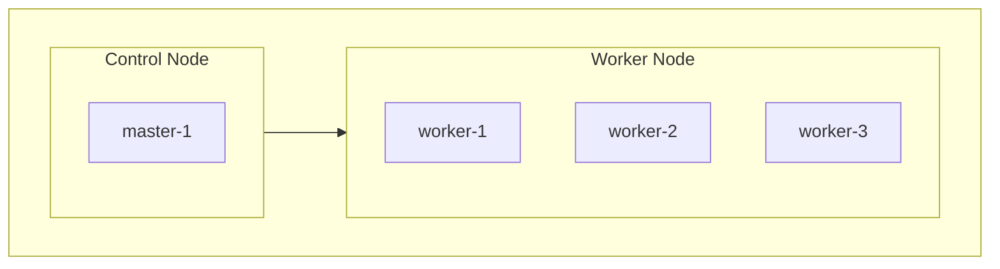

# k8s<!-- omit in toc -->

- 自宅k8sサーバのマニフェスト管理用リポジトリ

## Categories<!-- omit in toc -->

- [Nodes](#nodes)
- [Applications](#applications)
- [Secrets](#secrets)

## Nodes

## Applications

| Application | LoadbalancerIP |
| -- | -- |
| Longhorn | http://192.168.0.201 |
| docker-registry | https://192.168.0.202:5000 |
| OpenFaaS | http://192.168.0.203:8080 |
| Portainer | http://192.168.0.207:9000 |
| Argo CD | https://192.168.0.208 |
| price-monitoring - Frontend | http://192.168.0.217 |
| price-monitoring - Backend | http://192.168.0.210:3000 |
| price-monitoring - Backend - Sidekiq管理画面 | http://192.168.0.210:3000/sidekiq |

## Secrets

- プライベートリポジトリで管理する方針のため、本リポジトリには追加しないこと
