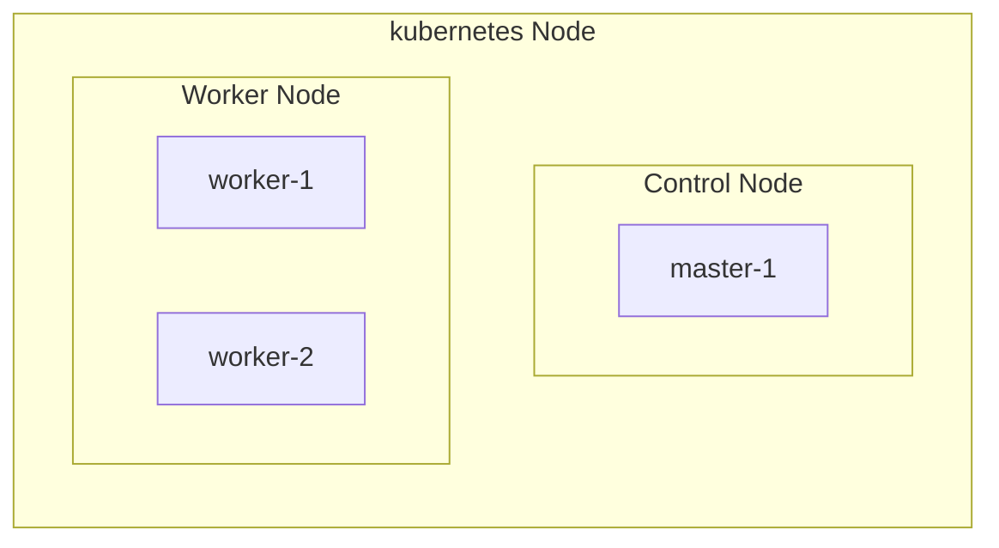
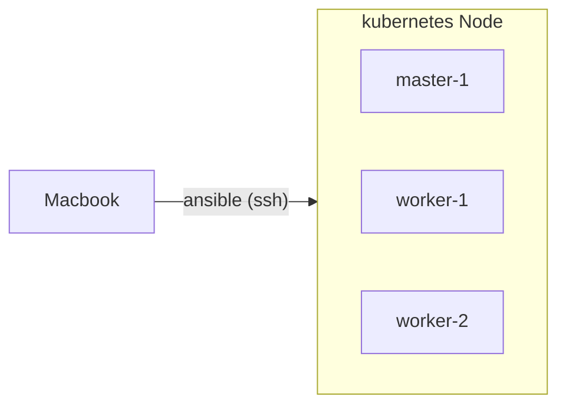

# k8s<!-- omit in toc -->

- ローカルサーバのk8sのセットアップや試行錯誤用リポジトリ

## TODO<!-- omit in toc -->

- 🏃Dockerコンテナ化したアプリケーションをデプロイできるようにする
- ArgoCDでGitOps化
- 外部アクセスできるようにする

## Categories<!-- omit in toc -->

- [Infra](#infra)
  - [Structure](#structure)
  - [Management](#management)
- [Setup](#setup)
  - [1. SSH](#1-ssh)
    - [hostname](#hostname)
  - [2. DNS](#2-dns)
  - [3. Ansible](#3-ansible)
  - [5. Kubernetes](#5-kubernetes)
    - [5-1. kubeadm](#5-1-kubeadm)
    - [5-2. Helm](#5-2-helm)
    - [5-3. Arkade](#5-3-arkade)
    - [5-4. MetalLB](#5-4-metallb)
    - [5-5. Longhorn](#5-5-longhorn)
    - [5-6. OpenFaaS](#5-6-openfaas)

## Infra

### Structure



### Management



## Setup

### 1. SSH

- TODO

#### hostname

- 各サーバのホスト名を変更する
- master-1

  ```bash
  sudo su
  hostnamectl set-hostname master-1
  reboot
  #=> reboot...

  hostname
  #=> master-1
  ```

- worker-1

  ```bash
  sudo su
  hostnamectl set-hostname worker-1
  reboot
  #=> reboot...

  hostname
  #=> worker-1
  ```

- worker-2

  ```bash
  sudo su
  hostnamectl set-hostname worker-2
  reboot
  #=> reboot...

  hostname
  #=> worker-2
  ```

### 2. DNS

- TODO

### 3. Ansible

- TODO

### 5. Kubernetes

#### 5-1. kubeadm

- TODO

#### 5-2. Helm

- TODO

#### 5-3. Arkade

- TODO

#### 5-4. MetalLB

- TODO

#### 5-5. Longhorn

- TODO

#### 5-6. OpenFaaS

- TODO
