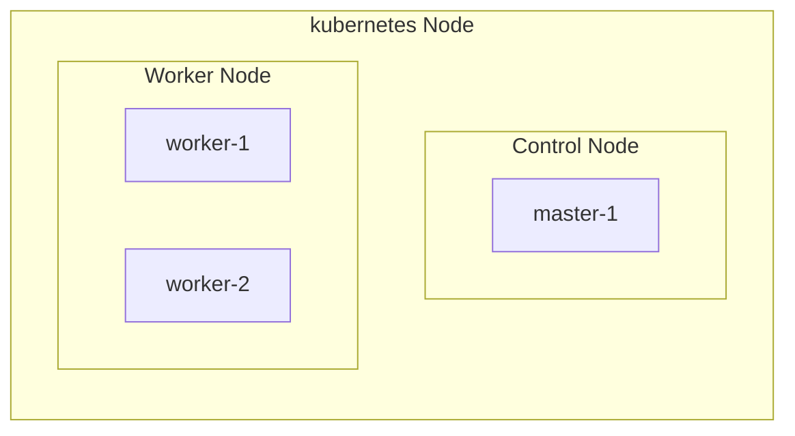
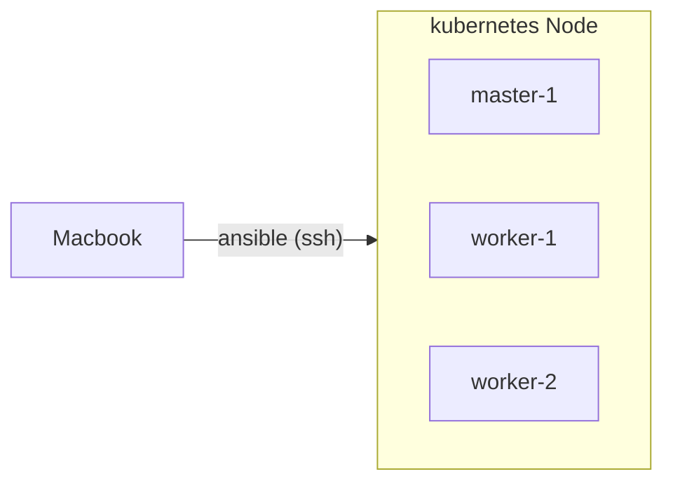

# k8s<!-- omit in toc -->

- ローカルサーバのk8sのセットアップや試行錯誤用リポジトリ

## TODO<!-- omit in toc -->

- 🏃Dockerコンテナ化したアプリケーションをデプロイできるようにする
- ArgoCDでGitOps化
- 外部アクセスできるようにする

## Categories<!-- omit in toc -->

- [Infra](#infra)
  - [Structure](#structure)
  - [Management](#management)
- [Setup](#setup)
  - [1. hostname](#1-hostname)
  - [2. IP固定](#2-ip固定)
  - [3. Macbookのhostsを修正](#3-macbookのhostsを修正)
  - [4. 公開鍵を登録](#4-公開鍵を登録)
  - [6. Ansible](#6-ansible)
  - [7. Kubernetes](#7-kubernetes)
  - [8. Helm](#8-helm)
  - [9. Arkade](#9-arkade)
  - [10. MetalLB](#10-metallb)
  - [11. Longhorn](#11-longhorn)
  - [12. OpenFaaS](#12-openfaas)
- [Command](#command)
  - [Kubernetes](#kubernetes)
  - [Ansible](#ansible)

## Infra

### Structure



### Management



## Setup

### 1. hostname

- 各サーバのホスト名を変更する

  - master-1

    ```bash
    sudo su
    hostnamectl set-hostname master-1
    reboot
    #=> reboot...

    hostname
    #=> master-1
    ```

  - worker-1

    ```bash
    sudo su
    hostnamectl set-hostname worker-1
    reboot
    #=> reboot...

    hostname
    #=> worker-1
    ```

  - worker-2

    ```bash
    sudo su
    hostnamectl set-hostname worker-2
    reboot
    #=> reboot...

    hostname
    #=> worker-2
    ```

### 2. IP固定

- 各サーバのIPを固定する
  - master-1

    ```bash
    sudo su
    vim /etc/netplan/01-network-manager-all.yaml

    # 以下の内容で更新する
    network:
      version: 2
      ethernets:
        enp1s0f0:
          addresses: [192.168.0.10/24]
          nameservers:
            addresses: [192.168.0.1]
          routes:
            - to: default
              via: 192.168.0.1
      renderer: NetworkManager
    ```

  - worker-1

    ```bash
    sudo su
    vim /etc/netplan/01-network-manager-all.yaml

    # 以下の内容で更新する
    network:
      version: 2
      ethernets:
        enp1s0f0:
          addresses: [192.168.0.11/24]
          nameservers:
            addresses: [192.168.0.1]
          routes:
            - to: default
              via: 192.168.0.1
      renderer: NetworkManager
    ```

  - worker-2

    ```bash
    sudo su
    vim /etc/netplan/01-network-manager-all.yaml

    # 以下の内容で更新する
    network:
      version: 2
      ethernets:
        enp1s0f0:
          addresses: [192.168.0.12/24]
          nameservers:
            addresses: [192.168.0.1]
          routes:
            - to: default
              via: 192.168.0.1
      renderer: NetworkManager
    ```

### 3. Macbookのhostsを修正

- サーバのホスト名でsshできるようにする

  ```bash
  sudo vim /etc/hosts

  # 以下を追記する
  192.168.0.10 master-1 master-1.local
  192.168.0.11 worker-1 worker-1.local
  192.168.0.12 worker-2 worker-2.local
  ```

### 4. 公開鍵を登録

- 各サーバに公開鍵を登録してSSHできるようにする

  ```bash
  ssh-copy-id <username>@<hostname>
  ```

### 6. Ansible

- MacbookにAnsibleをインストール

    ```bash
    brew install ansible
    ```

### 7. Kubernetes

- master-1にKubernetesの初期構築に必要なパッケージをインストールする

  1. 関連パッケージのインストール

      ```bash
      sudo apt update
      sudo apt install apt-transport-https ca-certificates curl gnupg-agent software-properties-common
      ```

  2. リポジトリのGPGキーを追加

      ```bash
      curl -fsSL https://download.docker.com/linux/ubuntu/gpg | sudo apt-key add -
      ```

  3. リポジトリを追加

      ```bash
      sudo add-apt-repository "deb [arch=amd64] https://download.docker.com/linux/ubuntu $(lsb_release -cs) stable"
      ```

  4. Dockerインストール

      ```bash
      sudo apt update
      sudo apt install -y docker-ce docker-compose-plugin
      docker --version

      #=>
      Docker version 20.10.16, build aa7e414
      ```

  5. kubeadm, kubelet, kubectlをインストール

      ```bash
      sudo apt update
      sudo apt install -y kubeadm kubelet kubectl
      ```

  6. 各サーバでswapを無効化

      ```bash
      # master-1, worker-1, worker-2で以下のコマンドを実行
      sudo swapoff -a
      sudo cp -p /etc/fstab /etc/fstab_`date +%Y%m%d`
      sudo vi /etc/fstab
      ```

  7. クラスタ構築

      ```bash
      # master-1で実行
      # userで実行する (rootユーザーで実行すると、毎回rootユーザー以外は毎回sudoつけないと動かない)
      sudo kubeadm init --control-plane-endpoint=master-1
      mkdir -p $HOME/.kube
      sudo cp -i /etc/kubernetes/admin.conf $HOME/.kube/config
      sudo chown $(id -u):$(id -g) $HOME/.kube/config
      ```

  8. クラスタにworkerノードを追加

      ```bash
      # Workerノードで実行するべきコマンドを表示
      kubeadm token create --print-join-command

      # 上記コマンドをWorkerノードで実行
      sudo kubeadm join master-1:6443 --token hogehoge --discovery-token-ca-cert-hash sha256:fugafuga

      # Masterノードでノード一覧を確認
      kubectl get node
      ```

  9. クラスタ構築後に各ノードをとりあえずReadyにしたい

      ```bash
      # calicoを導入する
      kubectl apply -f https://raw.githubusercontent.com/projectcalico/calico/v3.25.0/manifests/calico.yaml
      ```

  10. workerノードにラベルを設定

      ```bash
      kubectl label nodes <worker-node-name> node-type=worker
      ```

### 8. Helm

- Install

  ```bash
  # Masterノードで実行
  curl https://baltocdn.com/helm/signing.asc | gpg --dearmor | sudo tee /usr/share/keyrings/helm.gpg > /dev/null
  sudo apt-get install apt-transport-https --yes
  echo "deb [arch=$(dpkg --print-architecture) signed-by=/usr/share/keyrings/helm.gpg] https://baltocdn.com/helm/stable/debian/ all main" | sudo tee /etc/apt/sources.list.d/helm-stable-debian.list
  sudo apt-get update
  sudo apt-get install helm
  ```

### 9. Arkade

- Install

  ```bash
  curl -sLS https://get.arkade.dev | sudo sh
  ```

### 10. MetalLB

- Install

  ```bash
  # First add metallb repository to your helm
  helm repo add metallb https://metallb.github.io/metallb
  # Check if it was found
  helm search repo metallb
  # Install metallb
  helm upgrade --install metallb metallb/metallb --create-namespace \
  --namespace metallb-system --wait
  ```

- IP範囲を指定

  ```bash
  kubectl apply -f metallb/ip-address-pool.yaml
  ```

### 11. Longhorn

- TODO

### 12. OpenFaaS

- TODO

## Command

### Kubernetes

- とりあえずクラスタを完全初期化したい

    ```bash
    sudo kubeadm reset --force
    sudo systemctl stop kubelet
    sudo rm -rf /etc/kubernetes/
    rm -rf ~/.kube/
    sudo rm -rf /var/lib/kubelet/
    sudo rm -rf /var/lib/cni/
    sudo rm -rf /etc/cni/
    sudo rm -rf /var/lib/etcd/
    sudo iptables -F && iptables -X
    ```

### Ansible

- 簡単な疎通確認コマンド

    ```bash
    cd ansible
    ansible worker -m ping

    #=>
    master-1 | SUCCESS => {
        "changed": false,
        "ping": "pong"
    }
    worker-2 | SUCCESS => {
        "changed": false,
        "ping": "pong"
    }
    worker-1 | SUCCESS => {
        "changed": false,
        "ping": "pong"
    }
    ```

- 各サーバにパッケージをインストールする

    ```bash
    # iptablesをインストールする場合
    ansible worker -m apt -b --ask-become-pass -a "name=iptables state=present"
    ```

- 各サーバを再起動する

    ```bash
    ansible worker -b --ask-become-pass -m shell -a "reboot"
    ```