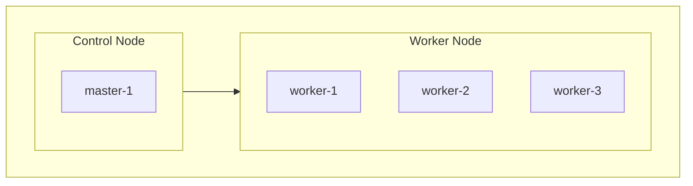

# k8s<!-- omit in toc -->

- 自宅k8sサーバのマニフェスト管理用リポジトリ

## Categories<!-- omit in toc -->

- [Nodes](#nodes)
- [Applications](#applications)
- [Secrets](#secrets)

## Nodes

## Applications

| Application | URL |
| -- | -- |
| Longhorn | https://longhorn.kuroweb.net |
| docker-registry | https://docker-registry.kuroweb.net |
| Portainer | https://portainer.kuroweb.net |
| Argo CD | https://argocd.kuroweb.net |
| price-monitoring → Frontend | https://price-monitoring.kuroweb.net |
| price-monitoring → Backend API | https://price-monitoring.kuroweb.net/api |
| price-monitoring → Sidekiq管理画面 | https://price-monitoring.kuroweb.net/sidekiq |
| price-monitoring → Auth Provider | https://auth.price-monitoring.kuroweb.net |

## Secrets

- プライベートリポジトリで管理する方針のため、本リポジトリには追加しないこと
