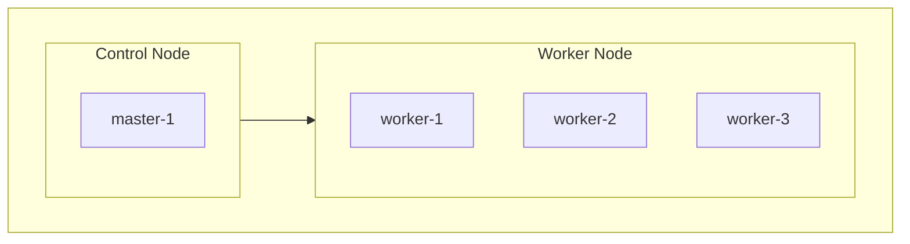

# k8s<!-- omit in toc -->

- 自宅k8sサーバのマニフェスト管理用リポジトリ

## Categories<!-- omit in toc -->

- [Nodes](#nodes)
- [IP allocation (MetalLB)](#ip-allocation-metallb)
- [Applications](#applications)
- [Secrets](#secrets)

## Nodes

## IP allocation (MetalLB)

- プール: `10.15.100.200-10.15.100.250` (evpnNt01), `10.15.200.200-10.15.200.250` (evpnNt02)
- 本表は 10.15.100.x (evpnNt01) の割当のみ。新規 Service で LoadBalancer を張る場合は未使用 IP を選ぶこと。

| IP | Namespace | Service / 用途 |
| -- | -- | -- |
| 10.15.100.201 | longhorn-system | Longhorn UI |
| 10.15.100.202 | docker-registry | Registry |
| 10.15.100.210 | price-monitoring | backend-service |
| 10.15.100.212 | price-monitoring | backend-db-service |
| 10.15.100.213 | price-monitoring | backend-redis-service |
| 10.15.100.215 | price-monitoring | backend-playwright-service |
| 10.15.100.217 | price-monitoring | frontend-service |
| 10.15.100.220 | ingress-nginx | Ingress Controller（本番・integration 共通） |
| 10.15.100.222 | price-monitoring-integration | backend-db-service |
| 10.15.100.223 | price-monitoring-integration | backend-redis-service |
| 10.15.100.225 | price-monitoring-integration | backend-playwright-service |
| 10.15.100.227 | price-monitoring-integration | frontend-service |
| 10.15.100.228 | price-monitoring-integration | backend-service |
| 10.15.100.230 | auth-provider | backend-service |
| 10.15.100.231 | auth-provider | backend-db-service |
| 10.15.100.234 | auth-provider-integration | backend-service |
| 10.15.100.235 | auth-provider-integration | backend-db-service |
| 10.15.100.236 | auth-provider-integration | backend-redis-service |

## Applications

| Application | URL |
| -- | -- |
| Longhorn | https://longhorn.kuroweb.net |
| docker-registry | https://docker-registry.kuroweb.net |
| Portainer | https://portainer.kuroweb.net |
| Argo CD | https://argocd.kuroweb.net |
| price-monitoring → Frontend | https://price-monitoring.kuroweb.net |
| price-monitoring → Backend API | https://price-monitoring.kuroweb.net/api |
| price-monitoring → Sidekiq管理画面 | https://price-monitoring.kuroweb.net/sidekiq |
| price-monitoring → Auth Provider | https://auth.price-monitoring.kuroweb.net |

## Secrets

- プライベートリポジトリで管理する方針のため、本リポジトリには追加しないこと
